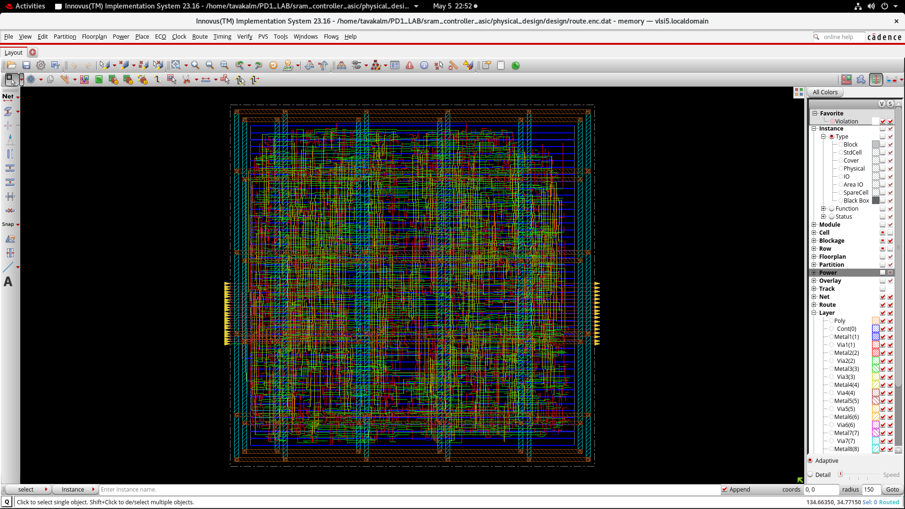

# SRAM Controller ASIC Design (RTL-to-GDSII)

## 📌 Overview

This project implements a complete ASIC flow for an SRAM Controller using Cadence Genus and Innovus.

## 🔧 Tools Used

* Cadence Genus (Synthesis)
* Cadence Innovus (Physical Design)
* TCL Scripting

## ⚙️ Design Flow

1. RTL → Netlist (Synthesis)
2. Floorplanning
3. Power Planning
4. Placement
5. Clock Tree Synthesis (CTS)
6. Routing
7. Timing & DRC Verification

---

## 📊 Results

* Timing violation fixed (-31ps → positive slack)
* DRC violations resolved (~7800 → clean)
* Reports generated: Timing, Power, Area

---

## 🖼️ Design Stages

### 🔹 Synthesis Layout

### 🔹 Floorplan

### 🔹 Physical Cells

### 🔹 Power Planning

### 🔹 Placement

### 🔹 Clock Tree (CTS)

### 🔹 Routing

### 🔹 Final GDS Layout

---

## 📁 Project Structure

* `synthesis/` → Genus flow
* `physical_design/` → Innovus flow
* `docs/` → Screenshots & results

---

## 🚀 Key Learnings

* Timing closure techniques
* DRC debugging and routing fixes
* Constraint optimization
* TCL scripting using dbGet

---

## 🎯 Highlights

* Complete RTL-to-GDSII implementation
* Timing and DRC closure achieved
* Industry-standard tools and flow
