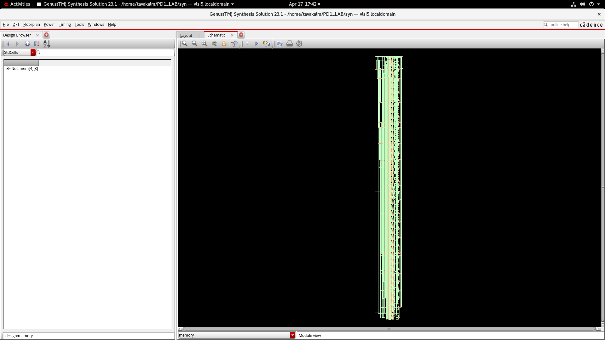
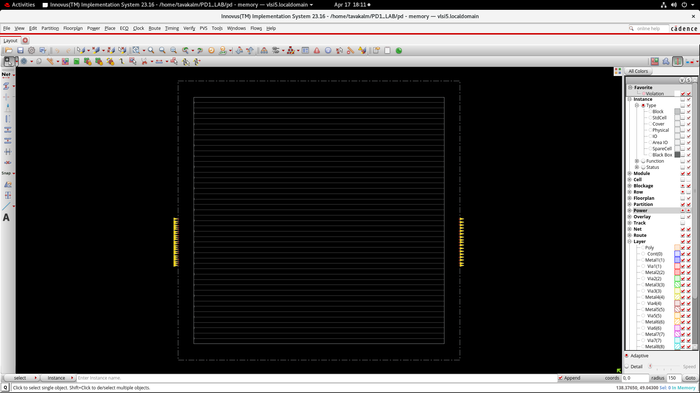
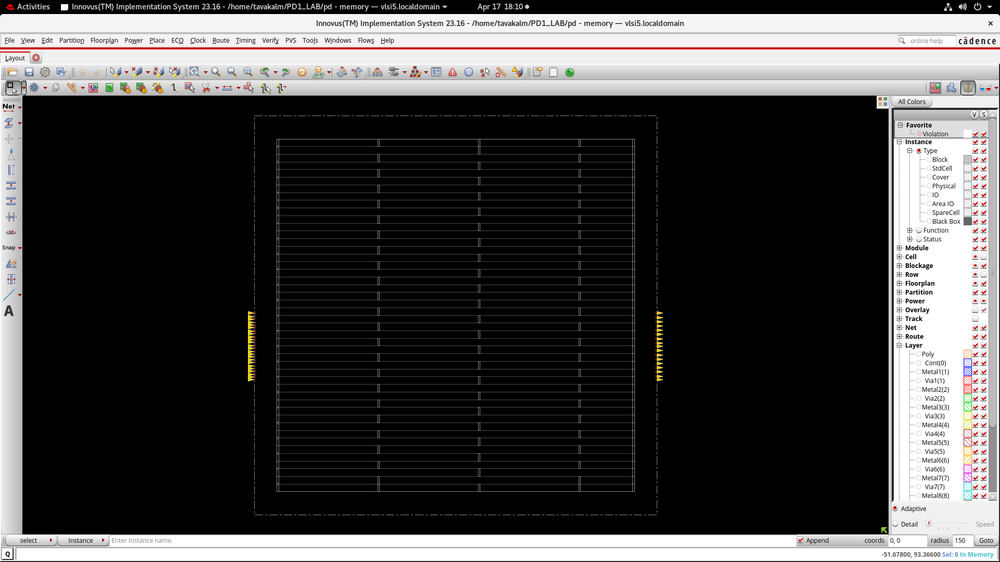
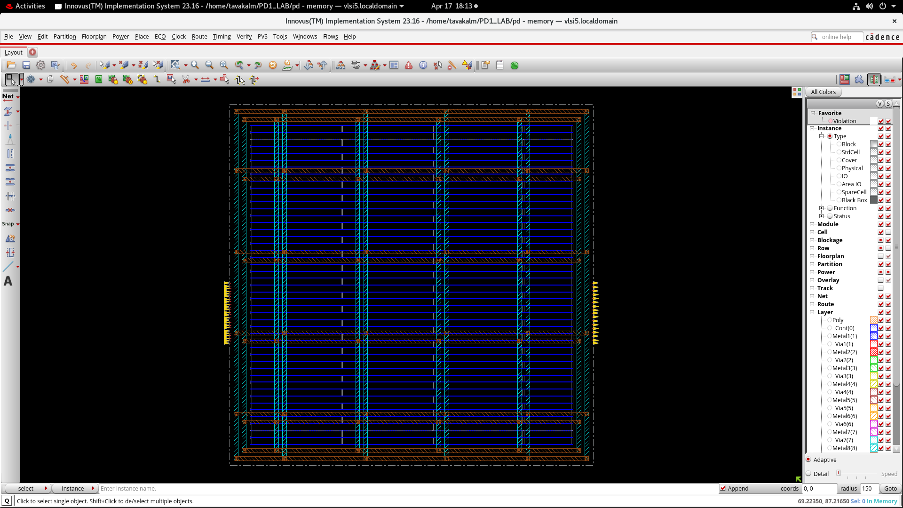
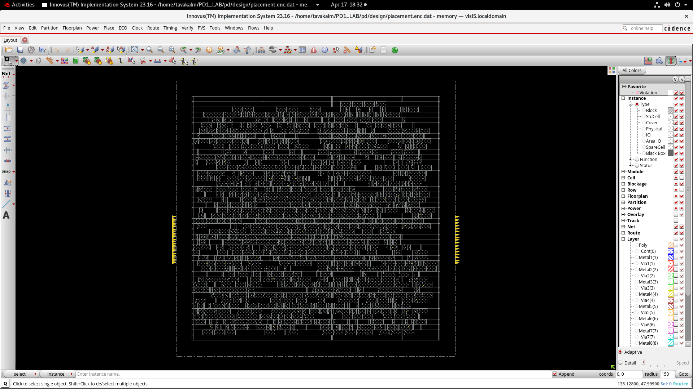
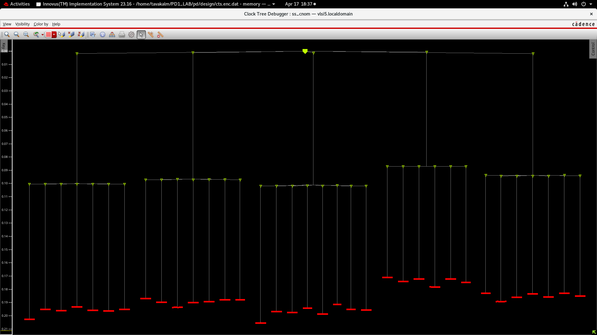
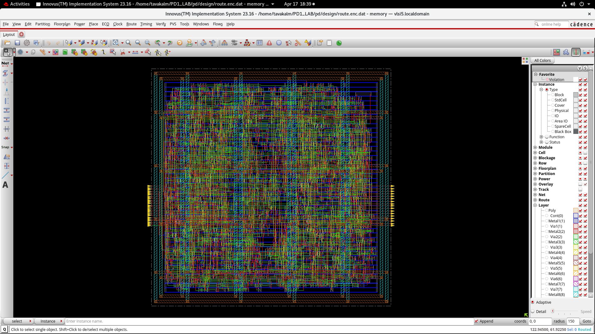

# SRAM Controller ASIC Design (RTL-to-GDSII)

🚀 Complete ASIC RTL-to-GDSII flow implementation with timing closure and DRC clean design using Cadence tools.

## 📌 Overview

This project implements a complete ASIC design flow for an SRAM Controller, starting from RTL and progressing through synthesis, floorplanning, placement, clock tree synthesis, routing, and final verification using industry-standard Cadence tools.

## 🔧 Tools Used

* Cadence Genus (Synthesis)
* Cadence Innovus (Physical Design)
* TCL Scripting

## ⚙️ Design Flow

1. RTL → Netlist (Synthesis)
2. Floorplanning
3. Power Planning
4. Placement
5. Clock Tree Synthesis (CTS)
6. Routing
7. Timing & DRC Verification

---

## 📊 Results

* Timing violation fixed (-31ps → positive slack)
* DRC violations resolved (~7800 → clean)
* Reports generated: Timing, Power, Area
  
---

## 📈 Detailed Timing Results

### 🔹 Post-CTS Results

* **WNS (Worst Negative Slack):** -0.026 ns
* **TNS (Total Negative Slack):** -0.096 ns
* **Violating Paths:** 12
* **DRC Violations:** 0 (clean)
* **Density:** 71.0%

---

### 🔹 Post-Route Setup Results

* **WNS:** -0.023 ns
* **TNS:** -0.023 ns
* **Violating Paths:** 1
* **Improvement:** Reduced from 12 → 1 violating paths
* **Density:** 73.4%

---

### 🔹 Post-Route Hold Results

* **WNS:** 0.000 ns ✅
* **TNS:** 0.000 ns ✅
* **Violating Paths:** 0
  👉 **Hold timing fully clean**

---

### 🔹 Clock Analysis

#### Clock Skew

* **Skew:** ~0.020 ns
  👉 Indicates well-balanced clock tree

#### Clock Latency

* **Latency:** ~0.224 ns
  👉 Controlled clock distribution network

---

## 🧠 Key Observations

* Significant timing improvement after routing stage
* Near-zero setup violation achieved (final WNS ≈ -0.023 ns)
* Fully clean hold timing (no violations)
* Zero DRC violations across all stages
* Balanced clock tree with low skew

---

## 🖼️ Design Stages

### 🔹 Synthesis Layout

### 🔹 Floorplan

### 🔹 Physical Cells

### 🔹 Power Planning

### 🔹 Placement

### 🔹 Clock Tree (CTS)

### 🔹 Routing

### 🔹 Final GDS Layout

---

## 📁 Project Structure

* `synthesis/` → Genus flow
* `physical_design/` → Innovus flow
* `docs/` → Screenshots & results

---

## 🚀 Key Learnings

* Timing closure techniques
* DRC debugging and routing fixes
* Constraint optimization
* TCL scripting using dbGet

---

## 🎯 Highlights
* Complete RTL-to-GDSII implementation
* Achieved timing and DRC clean design
* Used industry-standard Cadence tools
* Hands-on debugging of real physical design issues

---

## 👨‍💻 Author

Tavakalmastan

---
